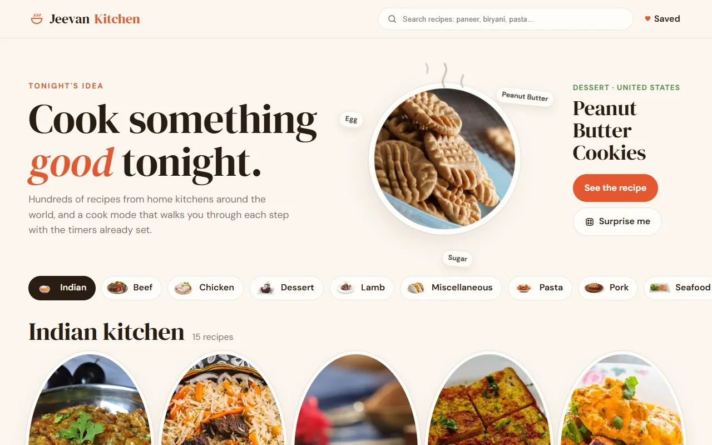

# JeevanKitchen

Find something to cook tonight, save the recipes you like, and cook them step by step with timers that come straight from the recipe.

**Live:** https://food-website-lovat-pi.vercel.app



## Features

- **Tonight's idea.** A random dish on a slowly turning plate, with its ingredients orbiting around it and steam rising off the top. **Surprise me** spins the plate and serves something else.
- **Browse** an Indian shelf and 14 categories, with plates that lift and turn under the pointer, or **search** as you type.
- **Recipes** with a tick-off ingredient list, the method as numbered steps, and a timer hint wherever a step mentions a time. Save favourites with a heartbeat; they stay in your browser.
- **Cook mode.** Full screen, one step at a time in large type, sliding forward or back with the buttons or arrow keys. Steps that mention a time ("simmer for 20 minutes") offer a one-tap timer with a ring countdown that chimes and vibrates when it's done. The screen stays awake while you cook.
- **No beef.** The Beef category is gone, and so is every recipe in other categories that uses beef, veal, oxtail, suet, tripe or a beef cut, whether it shows up in a category, search, *Surprise me* or an old link. `scripts/find-beef.mjs` lists the known ones ahead of time, and full recipes are checked ingredient by ingredient when they load.
- Links work: `#meal/52807` opens a recipe and the back button closes it. Keyboard friendly, labelled controls, and `prefers-reduced-motion` respected.

## What changed from the first version

The first version was a restaurant template with fake login and sign-up forms that asked for passwords and sent them nowhere, an order form that collected names, emails and phone numbers, and placeholder reviews. Those are gone. This version is a working cooking tool on real recipe data.

## How it works

Plain HTML, CSS and ES modules, with no build step.

| File | Job |
|---|---|
| `src/recipes.js` | Pure logic: ingredients, splitting instructions into steps (including hard-wrapped ones), finding timers, routes, favourites |
| `src/api.js` | TheMealDB requests with an in-memory cache, all passed through the beef filters |
| `src/beef-ids.js` | Recipes known to contain beef, generated by `scripts/find-beef.mjs` |
| `src/main.js` | Hero plate, categories, search, recipe dialog, cook mode with timers and wake lock |

## Run it

Serve the folder with any static server, for example:

```bash
npx serve .
```

Tests use Node's built-in runner (Node 20+):

```bash
npm test
```

## Credits

Recipes and photos from [TheMealDB](https://www.themealdb.com/), using its free test key for development and educational use.
